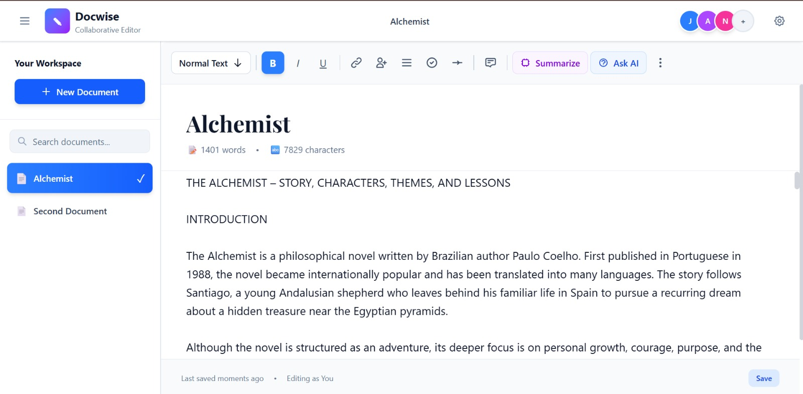
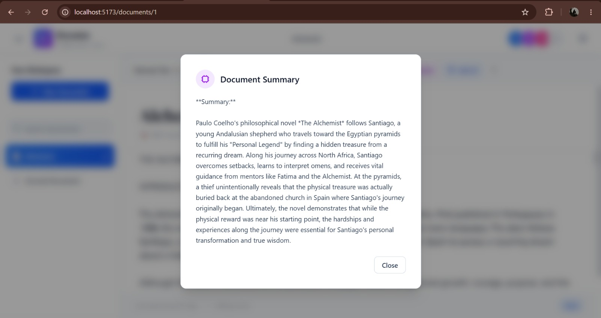
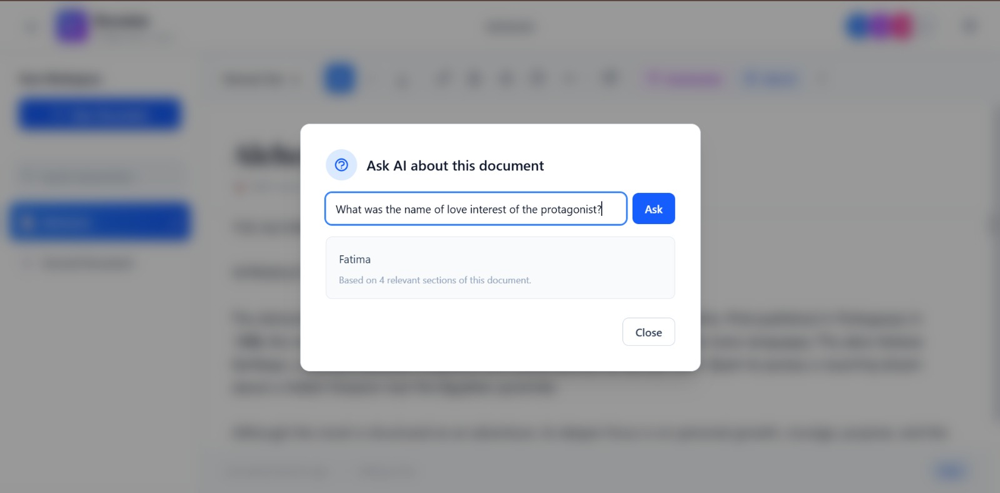

# DocWise

A real-time collaborative document editor with an AI-powered summarization and Q&A assistant.

Multiple users can edit the same document simultaneously, with changes syncing live across
all connected clients. Built on top of that, an integrated RAG (Retrieval-Augmented
Generation) service lets users summarize a document or ask questions about its content —
with answers grounded strictly in that document, not general AI knowledge.

---

## Screenshots

### Document Editor
Real-time collaborative editing, with document content persisted across sessions.



### AI Summarization
One-click summary generation for any document, powered by Google Gemini.



### AI-Powered Q&A (RAG)
Ask natural-language questions about a document's content. Answers are retrieved from the
document itself using semantic search — not guessed from general knowledge. If the answer
isn't in the document, the assistant says so instead of making one up.



---

## Features

### Real-Time Collaboration
- Multiple users editing the same document simultaneously
- Conflict-free synchronization powered by Yjs (CRDT)
- Live updates via Socket.IO
- Document content persisted across sessions

### Authentication
- User signup and login

### AI-Powered Document Assistant (RAG)
- **Summarize** — generate a concise summary of the current document on demand
- **Ask AI** — ask natural-language questions about a document's content; answers are
  retrieved from the document itself using semantic search, not guessed from general
  knowledge. If the answer isn't in the document, the assistant says so instead of
  making one up.

---

## Tech Stack

| Layer | Technology |
|---|---|
| Client | React, Vite, Tailwind CSS |
| Server | Node.js, Express, Socket.IO |
| Real-time sync | Yjs (CRDT) |
| RAG service | Python, FastAPI, LangChain, ChromaDB |
| LLM / Embeddings | Google Gemini |

---

## Project Structure

```
├── client/         # React + Vite front-end
├── server/         # Express + Socket.IO backend, real-time collaboration
├── rag-service/    # Python FastAPI microservice: document summarization & Q&A
└── DESIGN.md        # Full architecture documentation
```

---

## Getting Started

### 1. Client
```bash
cd client
npm install
npm run dev
```

### 2. Server
```bash
cd server
npm install
npm start
```

### 3. RAG Service
```bash
cd rag-service
python -m venv .venv
.venv\Scripts\activate      # Windows
pip install -r requirements.txt
# Add your Gemini API key to a .env file (see .env.example)
uvicorn main:app --port 8001
```

All three run independently and communicate over HTTP — see [DESIGN.md](DESIGN.md) for the
full architecture, including the RAG pipeline design, ingestion process, and known
limitations.

---

## Architecture Overview

```
Client (React)  →  Server (Express + Socket.IO)  →  RAG Service (FastAPI)  →  Gemini API
                                                              ↓
                                                          ChromaDB
```

The real-time editor and the AI assistant are fully decoupled — the RAG microservice can be
developed, tested, and deployed independently of the core collaboration engine.

---

## Contributors

| Name | Contribution |
|---|---|
| **Gaurang Goel** ([@Gaurnang](https://github.com/Gaurnang)) | Project owner. Built the core real-time collaborative editor — Yjs CRDT synchronization, Socket.IO real-time communication, and document persistence. |
| **Abhishek Dubey** ([@ByteWeaverX](https://github.com/ByteWeaverX)) | User authentication, and the full AI-powered RAG microservice — document ingestion pipeline, Gemini-based summarization, and retrieval-grounded Q&A. |

---

## License

This project is provided as-is for educational purposes.
